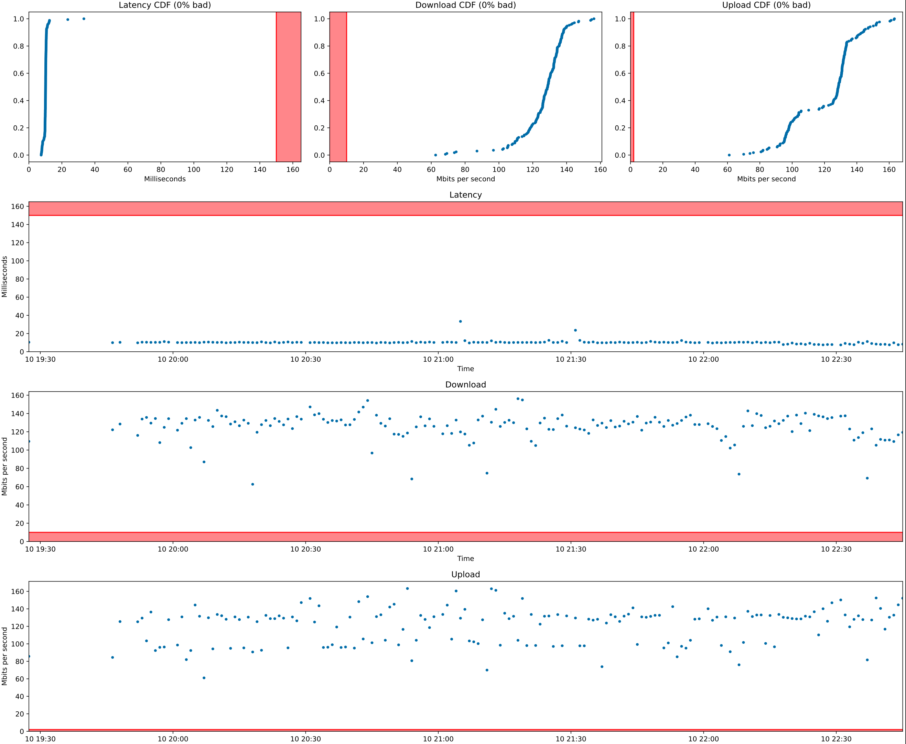

This is a tool that will measure and report metrics relevant to internet usage:
download bandwidth, upload bandwidth, and latency. The tool gathers metrics by
running a speedtest on speedtest.net for each minute the computer is awake.

This data is aggregated and reported as a single pdf with cummulative density
(CDF) and timeseries summaries for each metric:



The advantage of this tool over a speedtest is that the data is aggregated across
an arbitrary amount of time. This can help you convince your ISP that you actually
do have a problem, even when the ISP operator comes to your home and the
internet randomly happens
to be working when they are there.

# Setup

Dependencies: python3, matplotlib, csv, datetime, numpy

Install the [python client](https://github.com/sivel/speedtest-cli) to [speedtest.net].

Add a cronjob to run the speedtest every minute by running `crontab -e` and adding
the folowing line to the end of the file:

```
* * * * * /usr/local/bin/speedtest --csv 2>>~/speedtest.err 1>>~/speedtest.csv
```

(Make sure the file has an empty line at the end.)

Generate up-to-date graphs by running:

```
python3 plot_speedtest.py
```

This will create a `speedtest.pdf` file in this repo's `plots` folder.

If you want to generate the report only for the last `N` minutes, run:

```
python3 plot_speedtest.py N
```
